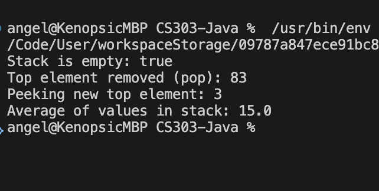

Angel Baldovinos - COMP-SCI 303 - Assignment 2

This program does not require user input. Everything is printed upon launch. SinglyLinkedList is entirely correct however does not interact with main per assignment instructions. Main will display the methods/functions from arrayListStack per assignment instructions. 

A stack is created in main with the first line of output displaying the status of a new blank list - isEmpty should return true;
There are 4 pushes in main that would make the stack be represented from bottom to top (head to tail) as [10, 32, 3, 83].
The line under the isEmpty print is the top (83) being popped (returned and removed).
The next line is for peeking (returning without removing) the top element (3).
The final line displays the average of all values in stack divided by the size of the stack. Our remaining elements are 10 + 32 + 3 which sum up to 45. With 3 elements in this stack our average will be 45 / 3 = 15.0. The (.0) is displayed because we are returning a double.