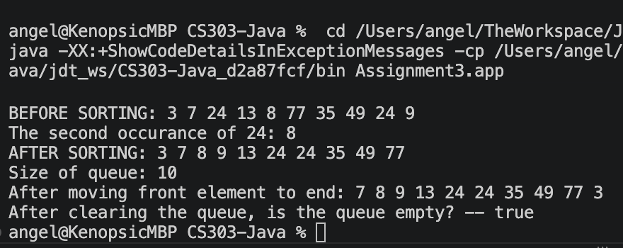

Angel Baldovinos - COMP-SCI 303 - Assignment 3

This program does not require user input (though that can be changed quickly by editing main) - instead all queue values, methods & functions are all defined in main. 

poll(), offer(), search() / contains(), clear(),  isEmpty() & size() are all directly used in main.

peek(), poll() & offer are used in moveToEnd().

The queue also executes an insertion sort on launch. Everything should be printed when executed.

24 appears twice in the queue, once in index 2 and once in index 8. The program returns 8 as the last occurrence of 24.